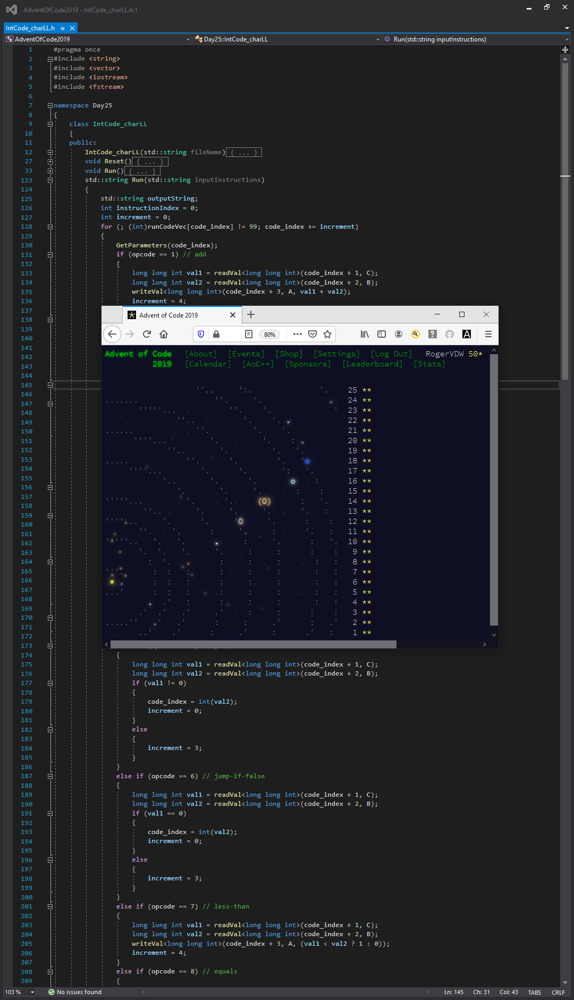
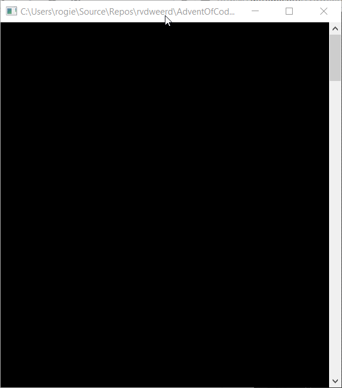
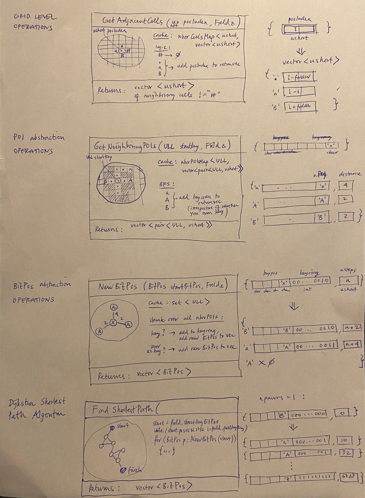

# AdventOfCode2019
My solutions (written in C++17) of adventofcode.com/2019

An amazing and rewarding learning experience.
@roger_vdw on https//www.reddit.com/r/adventofcode

Some action from the solutions: Pathfinding using a recursive backtracking algorithm

Abstractions used in a Maze class to solve the most challenging puzzle (day 18).
Yes- old school pen & paper.

